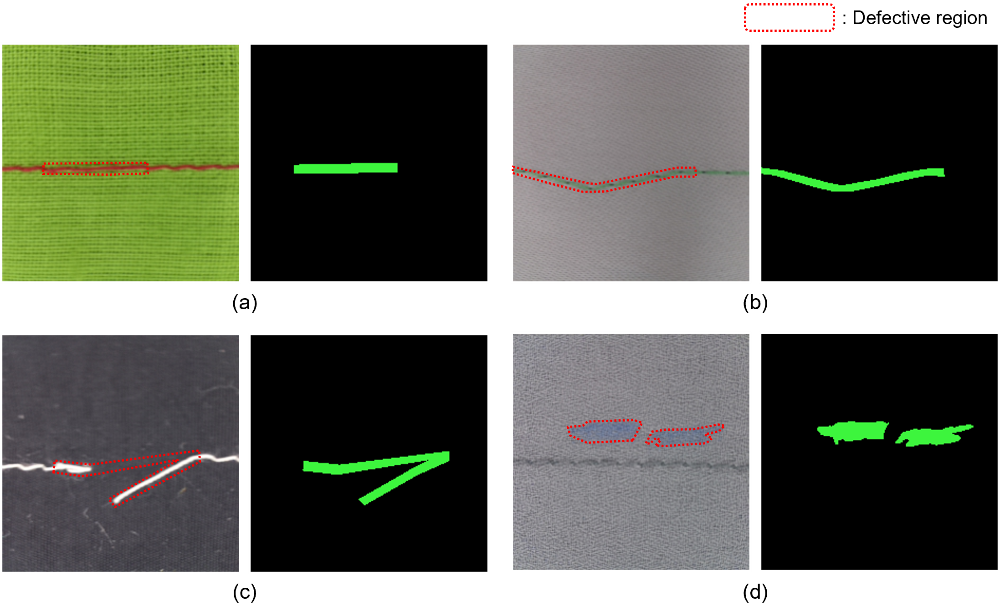

# StitchingNet-Seg
StitchingNet-Seg is a large-scale dataset featuring 10,836 images with pixel-level annotations, designed to advance automated quality inspection in the textile and apparel industry.

## Motivation
Automated quality control in the garment industry is challenging due to the labor-intensive nature of tasks and the non-rigid nature of textiles. While previous research focused on fabric-level defects (e.g., holes or stains), sewing stitch defects, which occur during the fabric joining process, have lacked high-quality, pixel-level datasets. StitchingNet-Seg bridges this gap by providing precise semantic segmentation masks. Unlike simple labels and bounding boxes, these masks capture intricate geometric features, including defect shape, size, and orientation, enabling AI models to perform root-cause analysis and real-time process monitoring in smart manufacturing applications.

## Dataset description
The dataset includes diverse sewing conditions and precise semantic masks to ensure model robustness:
- Total images: 10,836 images (derived and filterred from the original StitchingNet)
- Fabric varieties: 11 representative fabric types with various textures and colors
  - A. Cotton-Poly, B. Linen-Poly, C. Denim-Poly, D. Velveteen-Poly, E. Polyester-Poly, F. Satin-Core, G. Chiffon-Poly, H. Nylon-Core, I. Jacquard-Poly, J. Oxford-Core, and K. Polyester (coated)-Core
- Thread colors: Combinations of similar and contrasting thread colors.
- Classes: normal and 7 defective types
  - 0. Normal, 1. Skipped stitch, 2. Broken stitch, 3. Pinched fabric, 4. Crooked seam, 5. Thread sagging, 7. Stain and damage, and 10. Overlapped stitch
- Resolution: 224 × 224 pixels.

### Creation details
- Original source: <a href="https://github.com/hyungjungkim/StitchingNet" target="_blank">StitchingNet (14,565 sewing stitch images)</a>
- Time period (filtration and annotation): 2025.00 - 2025.00
- Annotation: Pixel-level semantic masks created using the <a href="https://cvat.ai" target="_blank">Computer Vision Annotation Tool (CVAT)</a>

### Data records
The dataset is organized into a hierarchical structure containing various fabric types and sewing defects. For the convenience of researchers, we provide original images, segmentation masks, and annotation files in COCO format.

### Sample images

### Code examples
We provide reference implementation codes in the 'code-examples' folder to help researchers get started with StitchingNet-Seg quickly.

## Original publication
(TBA)

## Download data
StitchingNet data can be downloaded directly from the following repositories:
- <a href="https://www.kaggle.com/datasets/hyungjung/stitchingnet-seg" target="_blank">Kaggle</a>
- <a href="https://data.mendeley.com/datasets" target="_blank">Mendeley data</a>

## License
The StitchingNet is licensed under [CC BY-NC 4.0](https://creativecommons.org/licenses/by-nc/4.0/). This means it is free for updated research and non-commercial use with proper attribution.

## Contact
Please email Hyungjung Kim (hyungjungkim@konkuk.ac.kr) and Junhyeok Park(wnsgur9910@konkuk.ac.kr) for any questions regarding the dataset.

